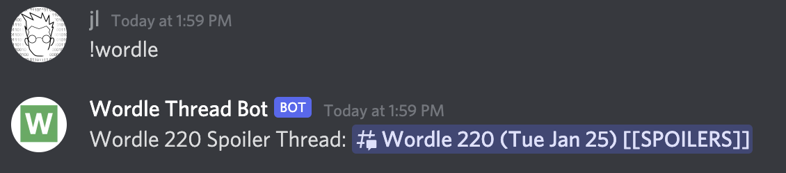
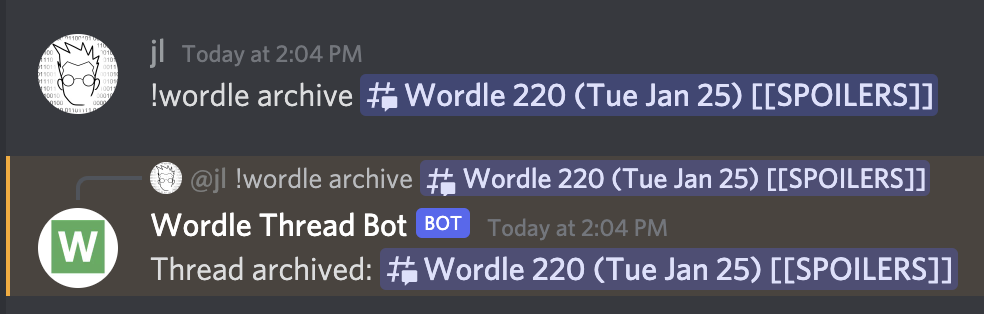
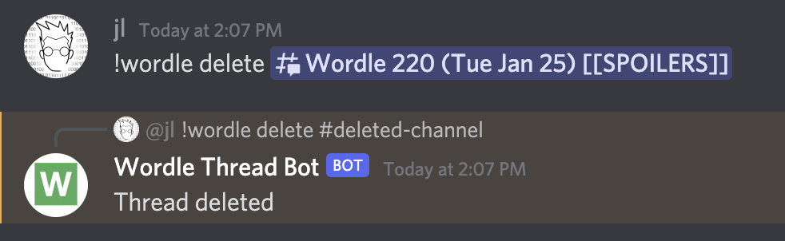
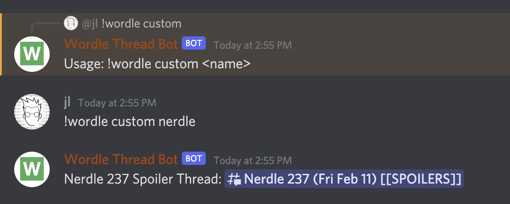

# WordleThreadBot

A discord bot for creating daily [Wordle](https://www.powerlanguage.co.uk/wordle/) discussion spoiler threads

## How to run

First, copy `config.example.yaml` to `config.yaml` and edit with your own values.

The bot will need the follow permissions: https://discordapi.com/permissions.html#326417525760

aka

- View Channels
- Send Messages
- Send Messages in Threads
- Create Public Threads
- Manage Messages
- Manage Threads

## Bot Usage

You can create a new daily wordle thread with `!wordle`:

To force a thread to be archived, you can do `!wordle archive`:

To delete a thread entirely, you can do `!wordle delete` (restricted to configured admins):

Both `archive` and `delete` can also be called with just a thread ID, i.e. `!wordle archive 123456`

## Wordle-like Games

You can also create threads for Wordle-like daily games (such as [Nerdle](https://nerdlegame.com/)) using `!wordle custom`:

The major caveat is that this currently uses the same start date as Wordle, so it may not align with games that have a different date.
